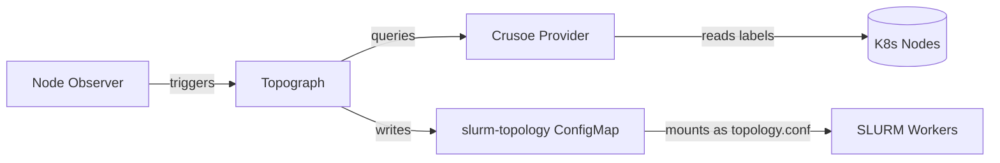

# Crusoe Provider

The Crusoe provider enables SLURM topology-aware scheduling for Crusoe Cloud clusters based on InfiniBand network partitions.

## Architecture

Crusoe uses a **2-tier topology** with a common datacenter root:

| Tier | Field | Label | Description |
|------|-------|-------|-------------|
| L1 (Datacenter) | `DatacenterID` | - | Common "crusoe" root for all nodes (enables cross-partition scheduling) |
| L2 (Spine) | `SpineID` | `crusoe.ai/ib.partition.id` | IB partition boundary |
| L3 (Block) | `BlockID` | `crusoe.ai/pod.id` | Leaf switch grouping |

### Topology Tree Structure

```
topology/tree (Common Datacenter Root - enables cross-partition scheduling)
═══════════════════════════════════════════════════════════════════════════

crusoe                                     ← Common datacenter root for ALL nodes
├── partition-ibp-1                        ← GPU partition 1 (have IB labels)
│   ├── pod-pod-1 → [gpu-1, gpu-2, gpu-3, gpu-4]
│   └── pod-pod-2 → [gpu-5, gpu-6, gpu-7, gpu-8]
├── partition-ibp-2                        ← GPU partition 2 (have IB labels)
│   ├── pod-pod-3 → [gpu-9, gpu-10]
│   └── pod-pod-4 → [gpu-11, gpu-12]
└── partition-cpu-partition                ← CPU fallback (no IB labels)
    └── pod-cpu-pod → [cpu-1, cpu-2, cpu-3, cpu-4]
```

### CPU Node Handling

Nodes without IB labels (CPU-only nodes) are automatically placed in a fallback partition:

```go
// k8s.go
const (
    DefaultDatacenter   = "crusoe"           // Common root for all nodes
    DefaultCPUPartition = "cpu-partition"
    DefaultCPUPod       = "cpu-pod"
)
```

This ensures CPU nodes are visible to SLURM scheduling while being grouped separately from GPU nodes.

### AcceleratorID (topology/block)

GPU nodes have `AcceleratorID` set to the IB partition ID, enabling SLURM to group GPUs by high-speed interconnect domain:

```go
// instance_topology.go
AcceleratorID: partitionID,  // IB partition = high-speed domain
```

CPU nodes have empty `AcceleratorID` since they don't have InfiniBand hardware.

## Slinky Bootstrap

**Problem**: SLURM controllers need topology to start, but slinky needs worker pods to generate topology.

**Solution**: When no worker pods exist, slinky generates dummy topology: `SwitchName=bootstrap Nodes=ALL`

Once worker pods deploy, it switches to real Crusoe topology automatically.

## How It Works



1. **Node Observer** watches for SLURM worker pod changes (add/remove)
2. **Topograph** receives trigger, queries K8s nodes via the **Crusoe Provider**
3. **Crusoe Provider** reads topology labels from nodes:
   - GPU nodes: `crusoe.ai/ib.partition.id`, `crusoe.ai/pod.id` (both required)
   - CPU nodes: Missing either label → falls back to `crusoe/cpu-partition/cpu-pod`
4. **Topograph** generates SLURM topology config and writes to `slurm-topology` ConfigMap
5. **SLURM Workers** mount the ConfigMap as `/etc/slurm/topology.conf`

See [Deploy Topograph](#deploy-topograph) for setup instructions.

### Why a Separate ConfigMap?

The slinky-operator manages its own ConfigMap (`slurm-*-config`) and continuously reconciles it, overwriting external changes. Topograph writes to a **separate** ConfigMap (`slurm-topology`) to avoid this conflict. The crusoe-slurm-operator mounts this ConfigMap to controller.

## Testing

> **Note**: The `slinky` engine requires in-cluster config (`rest.InClusterConfig()`) with no kubeconfig fallback. Test locally with simulation, then deploy to cluster for integration testing.

### Step 1: Unit Tests (Simulation)

Test the provider logic locally without a cluster:

```bash
# Run all Crusoe provider tests
go test -v ./pkg/providers/crusoe/...
```

Alternatively, you can run the simulator locally and manually test the provider:

```bash
# Start topograph locally
go run ./cmd/topograph -c config/topograph-config.yaml -v=2

# Test with simulation (returns request ID)
curl -X POST http://localhost:49021/v1/generate \
  -H "Content-Type: application/json" \
  -d '{
    "provider": {"name": "crusoe-sim", "params": {"model_path": "tests/models/crusoe-small.yaml"}},
    "engine": {"name": "slurm", "params": {"plugin": "topology/tree"}}
  }'
  # <request-id>

# Get the result (replace <request-id> with the ID from above)
curl http://localhost:49021/v1/topology\?uid\=<request-id>
```

### Step 2: Integration Tests (Deploy to Cluster)

#### Build and Push Docker Image

```bash
# Build for Linux amd64 (cross-compile from Mac)
docker buildx build --platform linux/amd64 \
  --build-arg TARGETOS=linux \
  --build-arg TARGETARCH=amd64 \
  -t ghcr.io/$GITHUB_USERNAME/topograph:dev \
  -f ./Dockerfile . --load

# Push to GitHub Container Registry
docker push ghcr.io/$GITHUB_USERNAME/topograph:dev
```

#### Deploy Topograph

```bash
helm upgrade --install topograph charts/topograph -n slurm \
  --set image.repository=ghcr.io/$GITHUB_USERNAME/topograph \
  --set image.tag=dev \
  --set node-observer.image.repository=ghcr.io/$GITHUB_USERNAME/topograph \
  --set node-observer.image.tag=dev \
  --set node-data-broker.initc.enabled=true \
  --set node-data-broker.initc.image.repository=ghcr.io/$GITHUB_USERNAME/topograph \
  --set node-data-broker.initc.image.tag=dev \
  --set global.provider.name=crusoe \
  --set global.engine.name=slinky \
  --set global.engine.params.namespace=slurm \
  --set 'global.engine.params.podSelector.matchLabels.app\.kubernetes\.io/component=worker' \
  --set global.engine.params.topologyConfigmapName=slurm-topology \
  --set global.engine.params.topologyConfigPath=topology.conf \
  --set global.engine.params.plugin=topology/tree
```

> **Note**: The node-data-broker adds `topograph.nvidia.com/instance` and `topograph.nvidia.com/region` annotations to nodes, which the slinky engine requires. For Crusoe, the init container sets instance ID = node name and region = "local".

#### Verification

In production, topology updates are triggered automatically by the **node-observer** component. When worker pods are added or removed, node-observer detects the change and sends a request to topograph.

```bash
# Watch topograph logs
kubectl logs -n slurm -l app.kubernetes.io/name=topograph -f

# Check the topology configuration added by topograph
kubectl get configmap slurm-topology -n slurm -o yaml
```

## Configuration

### Provider Parameters

| Parameter | Type | Description |
|-----------|------|-------------|
| `nodeSelector` | `map[string]string` | Optional: Filter nodes by labels |

### Required Node Labels (GPU Nodes)

| Label | Description | Required |
|-------|-------------|----------|
| `crusoe.ai/ib.partition.id` | IB partition UUID | ✅ Yes |
| `crusoe.ai/pod.id` | Pod (leaf switch) UUID | ✅ Yes |
| `crusoe.ai/ib.partition.name` | Human-readable partition name | ❌ Optional (falls back to partition ID) |

**Note**: GPU nodes require **both** partition and pod labels. CPU nodes missing either label are automatically assigned to the common datacenter fallback partition.

## Output Format

Example SLURM topology.conf output (GPU only):

```
# datacenter-crusoe=crusoe
SwitchName=datacenter-crusoe Switches=partition-ibp-[1-2]
# partition-ibp-1=ibp-1
SwitchName=partition-ibp-1 Switches=pod-pod-[1-2]
# partition-ibp-2=ibp-2
SwitchName=partition-ibp-2 Switches=pod-pod-[3-4]
# pod-pod-1=pod-1
SwitchName=pod-pod-1 Nodes=vm-[11-14]
# pod-pod-2=pod-2
SwitchName=pod-pod-2 Nodes=vm-[21-24]
# pod-pod-3=pod-3
SwitchName=pod-pod-3 Nodes=vm-[31-34]
# pod-pod-4=pod-4
SwitchName=pod-pod-4 Nodes=vm-[41-44]
```

Mixed GPU + CPU output:

```
# datacenter-crusoe=crusoe
SwitchName=datacenter-crusoe Switches=partition-cpu-partition,partition-ibp-1
# partition-cpu-partition=cpu-partition
SwitchName=partition-cpu-partition Switches=pod-cpu-pod
# partition-ibp-1=ibp-1
SwitchName=partition-ibp-1 Switches=pod-pod-[1-2]
# pod-cpu-pod=cpu-pod
SwitchName=pod-cpu-pod Nodes=cpu-[01-02]
# pod-pod-1=pod-1
SwitchName=pod-pod-1 Nodes=vm-[11-12]
# pod-pod-2=pod-2
SwitchName=pod-pod-2 Nodes=vm-21
```

## Troubleshooting

### Docker build fails on Mac

Error:
```
/usr/local/go/pkg/tool/linux_amd64/compile: signal: segmentation fault (core dumped)
```

Add the platform to Dockerfile:

`FROM --platform=linux/arm64 golang:1.24.7 AS builder`

### Node Observer Not Detecting Pod Changes

If topology doesn't update when SLURM worker pods are added/removed:

**Increase verbosity** to see detailed pod change detection and topology generation:
```bash
# Update the node observer deployment to use verbosity 5
kubectl patch deployment topograph-node-observer -n slinky -p '{"spec":{"template":{"spec":{"containers":[{"name":"node-observer","args":["-v=5"]}]}}}}'

# Update the topograph deployment to use verbosity 5
kubectl patch deployment topograph -n slinky -p '{"spec":{"template":{"spec":{"containers":[{"name":"topograph","args":["-v=5"]}]}}}}'

# Check logs for detailed pod tracking
kubectl logs -n slinky deployment/topograph-node-observer -f

# Check logs for detailed topology generation 
kubectl logs -n slinky deployment/topograph -f

Most likely if the observer is not watching for the pod using the slinky labels the topograph will not be triggered.